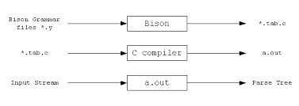

## Lab 1
#### Group Members
---
* 121800
* 121195
* 119988
* 121199

### Instructions
---
1. Give a brief description of the following tools: Flex, Bison, Lex, Yacc.
1. The description should have: 3-5 lines definition, diagram and code snippet.
1. Submit a text file having the link to your Github repo having the colab/jupyter nb file.

#### Bison
Bison is a general purpose parser generator that converts a grammar description for an LALR (Look Ahead Left Right) context free grammar into a C program that parsers that grammar. It is used in conjuction with Flex to create programs that are able to process input strings. Parsers generated with Bison take in a sequence of tokens from the lexical analyzer (generated with Flex), and recognizes it's structure in the form of a parse tree. The parse tree represents a mapping of grammar symbols to data elements.




##### Example Code
```C
%{
/*definitions*/
%}

%union{
int num;
char sym;
}
%token EOL
%token NUMBER

/*rules*/
%%
%%
```
